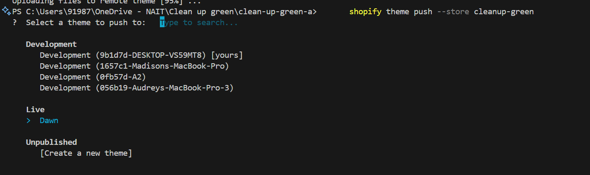

# Clean-Up Green - Fantastic Five 
Members = Alec, Audrey, Liam, Madison, and Simran

## Shopify Theme Development Instructions

### Store Information
- **Store Name**: Cleanup Green  
- **Store URL**: [https://cleanup-green.myshopify.com/](https://cleanup-green.myshopify.com/)  
- **Password**: maiwul  

## Useful Commands

### Local Development
To work in a local environment, use:
```sh
shopify theme dev -e development
```
(*Ensure `shopify.theme.toml` is configured correctly*)  

If the above command doesn't work, try:
```sh
shopify theme dev
```

### Pushing Theme Changes
To push your theme changes to the main website, use:
```sh
shopify theme push --store cleanup-green
```

### Theme Push Process
Follow these steps to push your changes to the live Shopify theme:
1. Use the command:
   ```sh
   shopify theme push --store cleanup-green
   ```
2. Select **LIVE > DAWN** theme to update the live store.

Here is an example image showing the process:


---
## Image Handling in Shopify

### **Uploading Images**
- Do **not** upload images into the `assets` folder.
- Instead, upload them to **Content > Files** on the main website.

### **Using Uploaded Images**
Once an image is uploaded to **Files**, reference it in your theme using the `file_url` filter:
```liquid

```

---
## Linking CSS in Shopify
To apply custom styles, you must link your CSS in `theme.liquid`:
1. Open `theme.liquid`
2. Press `Ctrl + F` and search for "stylesheet"
3. Add your CSS link below existing stylesheets:
   ```liquid
   {{ 'section-cost-comparison.css' | asset_url | stylesheet_tag }}
   ```

---
## Rendering Sections in Shopify Liquid vs JSON

### **1. Rendering Sections in Liquid Files**
In Shopify, sections are rendered within Liquid templates using the `` tag:

#### Example in Liquid:
If you have a section called `hero-banner.liquid` in the `sections` directory, include it in a template like this:
```liquid

```

### **2. Rendering Sections in JSON Files**
Shopify's Online Store 2.0 uses JSON templates for layout definitions, where sections are defined within the `sections` array.

#### Example in JSON (index.json):
```json
{
  "sections": {
    "hero-banner": {
      "type": "hero-banner",
      "settings": {
        "heading": "Welcome to our Store!"
      }
    }
  },
  "order": ["hero-banner"]
}
```

### **Summary**
- **Liquid Rendering**: Uses `` to directly render sections within a template.
- **JSON Rendering**: Sections are defined in the JSON file with the `sections` key, and the `order` key controls their layout sequence.
- **Key Difference**: Liquid renders sections immediately in templates, while JSON defines layout order for Shopify’s Online Store 2.0.

---
### **Happy Coding! 🎉**

